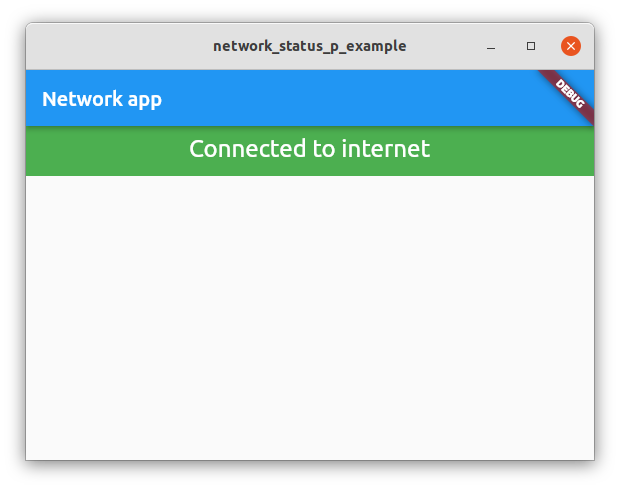
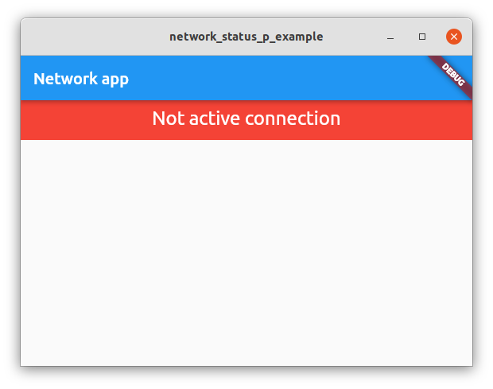

# network_status_p

This is a simple Flutter plugin for detecting network status. It provides a status bar which automatically updates depending on the whether the network is on or off. 

## Getting Started

In order to use the package, you need to add dependency to your project:
```yaml
  dependencies:
    network_status_p: ^0.0.2
```

In source code, include the following:
```dart
  import 'package:network_status_p/network_status_p.dart';
```

## Usage
You can either use `NetChecker()` or with a parameter `NetChecker(netDuration: Duration(seconds: 2))` which specifies the interval of checking network status.
If no parameter is given, the default duration is 1 seconds.

## Example
Small application that showcases how this plugin can be used:
```dart
import 'package:flutter/material.dart';
import 'package:network_status_p/network_status_p.dart';
  
void main() => runApp(MyApp());

/// this is your APP Main screen configuration
class MyApp extends StatelessWidget {
  MyApp({Key? key}) : super(key: key);

  @override
  Widget build(BuildContext context) {
    return MaterialApp(
      home: HomePage(),
    );
  }
}


class HomePage extends StatefulWidget {
  const HomePage({Key? key}) : super(key: key);
  
  @override
  State<HomePage> createState() => _HomePageState();
}
  
class _HomePageState extends State<HomePage> {
  
  @override
  Widget build(BuildContext context) {
    return Scaffold(
      appBar: AppBar(
        title: const Text("Network app"),
      ),
      body: NetChecker(
        netDuration: Duration(seconds: 2),
      )
    );
  }
}
```

## Screenshots
Active Network             |  Network is inactive
:-------------------------:|:-------------------------:
  |  

## Links
Link to the plugin in pub.dev: [https://pub.dev/packages/network_status_p](https://pub.dev/packages/network_status_p)
